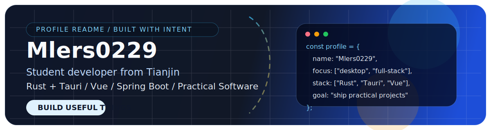

<div align="center">
  

  <br />
  <br />

  

  <br />
  <br />

  <p>
    <a href="https://github.com/Mlers0229">
      
    </a>
    
    
  </p>

  <p>
    
    
    
  </p>
</div>

## Contribution Snake / 提交贪吃蛇

<div align="center">
  <picture>
    <source
      media="(prefers-color-scheme: dark)"
      srcset="https://raw.githubusercontent.com/Mlers0229/Mlers0229/output/github-contribution-grid-snake-dark.svg"
    />
    <source
      media="(prefers-color-scheme: light)"
      srcset="https://raw.githubusercontent.com/Mlers0229/Mlers0229/output/github-contribution-grid-snake.svg"
    />
    
  </picture>
</div>

## About Me / 关于我

- 来自天津，现阶段主要在做学生开发者视角下的实用型项目。
- 比较关注桌面工具、全栈应用和“真的能被人用起来”的产品体验。
- 最近投入较多的方向是 `Rust`、`Tauri v2`、`Vue`、`Spring Boot`、`FastAPI` 和多 Agent 应用。
- 我希望把每个项目都做得更完整一点，不只是能跑起来，还要有清晰结构、可维护性和真实使用价值。

## Current Focus / 近期方向

```text
- 用 Rust + Tauri 打磨更现代的桌面工具
- 推进 LearnFlow 这类具备完整闭环的智能学习平台原型
- 通过全栈项目训练产品意识和工程落地能力
- 持续改进项目结构、可维护性和开发体验
```

## Tech Stack / 技术栈

<div align="center">
  
</div>

## Featured Projects / 代表项目

<div align="center">
  <a href="https://github.com/Mlers0229/LearnFlow">
    
  </a>
  <a href="https://github.com/Mlers0229/MlersTools">
    
  </a>
  <a href="https://github.com/Mlers0229/MlersBlog">
    
  </a>
</div>

<table>
  <tr>
    <td width="33%">
      <h3>LearnFlow</h3>
      <p>一个面向智能学习场景的多 Agent 学习规划平台，围绕目标拆解、计划生成、资源推荐、练习评测与复盘优化构建完整闭环。</p>
    </td>
    <td width="33%">
      <h3>MlersTools</h3>
      <p>一个基于 Rust + Tauri v2 的现代桌面工具集，方向是可扩展、可维护、适合持续迭代。</p>
    </td>
    <td width="33%">
      <h3>MlersBlog</h3>
      <p>一个前后端分离的博客系统项目，强调完整功能、清晰组织和更好的使用体验。</p>
    </td>
  </tr>
</table>

## GitHub Stats / 数据概览

<div align="center">
  
  
</div>

<div align="center">
  
</div>

## Auto Metrics / 自动指标图

<div align="center">
  
  
  
</div>

## Contact / 联系方式

- GitHub: [github.com/Mlers0229](https://github.com/Mlers0229)
- School: [Tianjin Renai College](https://www.tjrac.edu.cn/)

<div align="center">
  <sub>参考了优秀 GitHub Profile README 的结构感和节奏，但内容已经改成更贴合我自己的项目、技术栈与方向。</sub>
</div>
