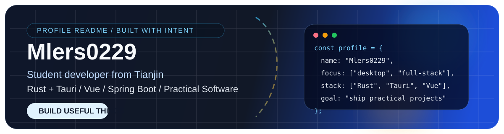

<div align="center">
  

  <br />

  

  <p>
    <a href="https://github.com/Mlers0229">
      
    </a>
    
    
    
  </p>

  <sub>Student developer · Product-minded builder · Open-source explorer</sub>
</div>

---

## 👋 About Me / 关于我

> 把“能运行”继续打磨成“好用、清晰、可维护”的产品。

- 🎓 来自天津的学生开发者，关注桌面工具、全栈应用与真实的产品体验
- 🦀 正在深入 `Rust`、`Tauri v2`，探索更现代的跨平台桌面开发
- 🌐 使用 `Vue`、`Spring Boot`、`FastAPI` 构建完整的全栈应用
- 🤖 对多 Agent 应用、智能学习工具和工程化落地保持长期兴趣

## 🚀 What I'm Building / 近期方向

```text
01  用 Rust + Tauri 打磨现代、轻量的桌面工具
02  推进具备完整闭环的智能学习平台原型
03  在全栈项目中训练产品意识与工程落地能力
04  持续改善项目结构、可维护性和开发体验
```

## 🧰 Tech Stack / 技术栈

<div align="center">
  <p><strong>Core · Desktop · Frontend · Backend · Data</strong></p>
  
</div>

## ✨ Featured Projects / 代表项目

<table>
  <tr>
    <td width="50%" valign="top">
      <h3 align="center">
        <a href="https://github.com/Mlers0229/LearnFlow">LearnFlow</a>
      </h3>
      <p align="center"><strong>多 Agent 智能学习规划平台</strong></p>
      <p>围绕目标拆解、学习规划与执行反馈，探索真正具备完整学习闭环的智能应用。</p>
      <p align="center">
        <a href="https://github.com/Mlers0229/LearnFlow">
          
        </a>
      </p>
    </td>
    <td width="50%" valign="top">
      <h3 align="center">
        <a href="https://github.com/Mlers0229/MlersTools">MlersTools</a>
      </h3>
      <p align="center"><strong>Rust + Tauri 桌面工具集</strong></p>
      <p>聚焦日常场景与使用效率，把常用能力组合成轻量、直观、真正可用的桌面体验。</p>
      <p align="center">
        <a href="https://github.com/Mlers0229/MlersTools">
          
        </a>
      </p>
    </td>
  </tr>
</table>

## 📊 GitHub Activity / 数据概览

<table>
  <tr>
    <td width="50%" align="center">
      <picture>
        <source
          media="(prefers-color-scheme: dark)"
          srcset="https://github-readme-stats.vercel.app/api?username=Mlers0229&amp;show_icons=true&amp;theme=github_dark&amp;hide_border=true&amp;rank_icon=github"
        />
        <source
          media="(prefers-color-scheme: light)"
          srcset="https://github-readme-stats.vercel.app/api?username=Mlers0229&amp;show_icons=true&amp;theme=default&amp;hide_border=true&amp;rank_icon=github"
        />
        
      </picture>
    </td>
    <td width="50%" align="center">
      <picture>
        <source
          media="(prefers-color-scheme: dark)"
          srcset="https://github-readme-stats.vercel.app/api/top-langs/?username=Mlers0229&amp;layout=compact&amp;theme=github_dark&amp;hide_border=true"
        />
        <source
          media="(prefers-color-scheme: light)"
          srcset="https://github-readme-stats.vercel.app/api/top-langs/?username=Mlers0229&amp;layout=compact&amp;theme=default&amp;hide_border=true"
        />
        
      </picture>
    </td>
  </tr>
</table>

<div align="center">
  <picture>
    <source
      media="(prefers-color-scheme: dark)"
      srcset="https://raw.githubusercontent.com/Mlers0229/Mlers0229/output/github-contribution-grid-snake-dark.svg"
    />
    <source
      media="(prefers-color-scheme: light)"
      srcset="https://raw.githubusercontent.com/Mlers0229/Mlers0229/output/github-contribution-grid-snake.svg"
    />
    
  </picture>
</div>

<details>
  <summary><strong>📈 View detailed auto-generated metrics / 查看详细自动指标</strong></summary>

  <br />

  <div align="center">
    
  </div>

  <table>
    <tr>
      <td width="50%" align="center">
        
        <br />
        <sub>Language footprint</sub>
      </td>
      <td width="50%" align="center">
        
        <br />
        <sub>Contribution calendar</sub>
      </td>
    </tr>
  </table>
</details>

## 📫 Connect / 联系我

<div align="center">
  <a href="https://github.com/Mlers0229">
    
  </a>
  <a href="https://www.tjrac.edu.cn/">
    
  </a>
</div>

---

<div align="center">
  <sub>Stay curious · Keep building · Ship useful things</sub>
</div>
